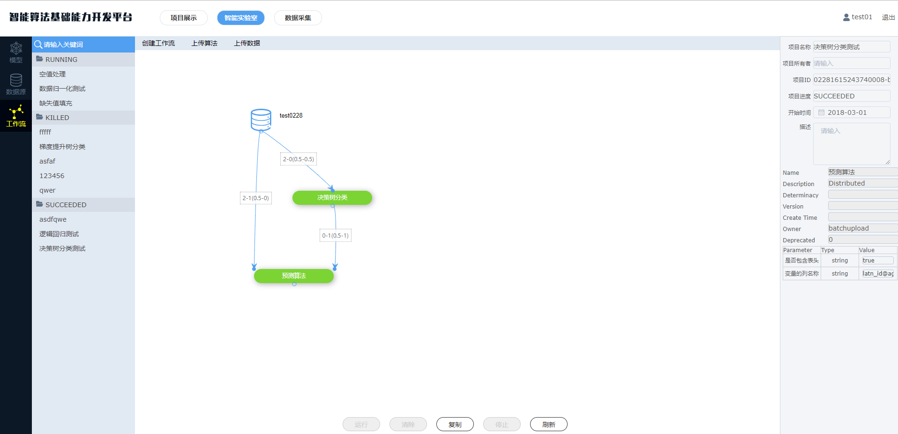
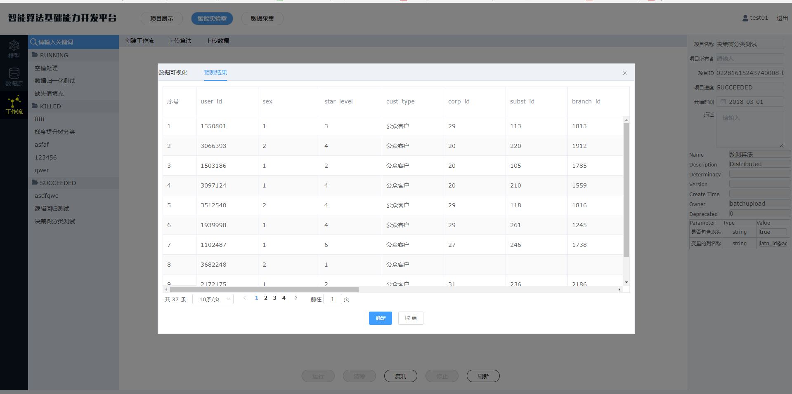
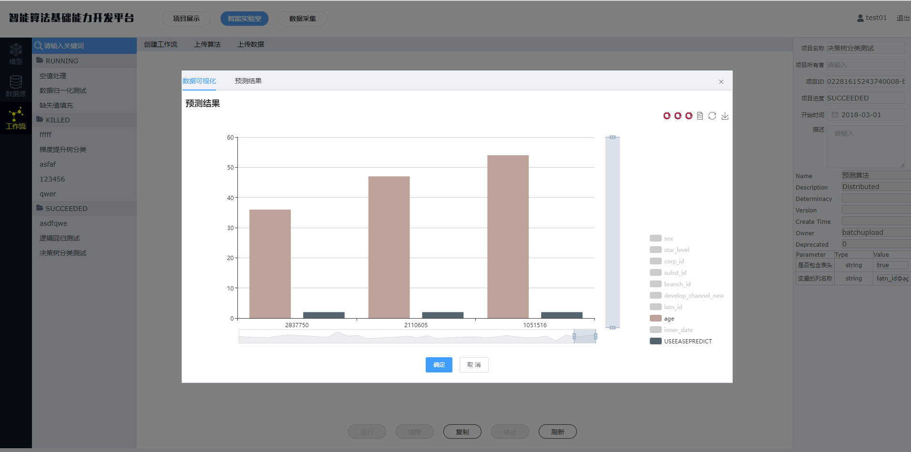
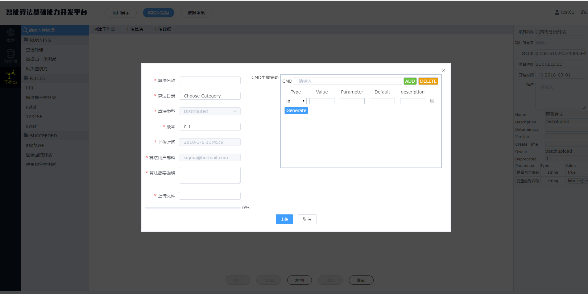
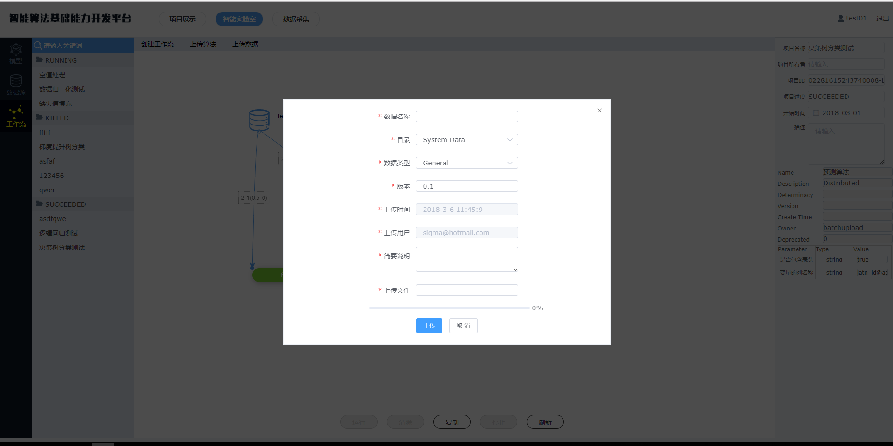

# 智能算法基础能力开发平台

------------------
## 简介

  平台集成了智能数据采集、数据分析挖掘、数据可视化的基础能力开发平台。基于Docker容器云技术，研发了一套从大数据采集、数据清洗到数据挖掘和数据处理可视化的功能。可视化界面的工作环境实现了拖拽式、点击式等类似于桌面操作方式，从最初所的网站数据采集到对采集回来的数据进行数据清洗和数据分析，最后以可视化图表的形式呈现分析结果。 

  平台主要包括智能算法能力组件工厂和大数据能力展示平台两部分。

  **大数据能力开发平台**主要提供了业务模型验证的可视化操作界面，后台基于spark封装常用的算法模型，可以通过页面拖拉快速构建业务模型，验证效果，并对结果提供了可视化功能。

  **智能算法能力组件工厂**主要提供了三大类常用的算法接口：（1）机器视觉API，主要包括图像识别模型、目标跟踪模型、图像标签化等;（2）自然语言处理API，主要包括词向量模型、知识表示模型Trans系列、seq2seq模型等;（3）推荐算法API，主要包括奇异值分解、网络表示学习如DeepWalk等。

## 安装部署
--------------------

* 大数据开发平台系统包含了四大模块：客户端、服务端、集群等；

**（1）前端端**

  [前端部署文档及介绍](./doc/FontendDoc.md) 

**（2）服务端** 

 [服务端部署文档](./doc/ServerDoc.md) 

**（3）集群**

 [集群部署文档](./doc/ClustersDoc.md) 
 

## 操作界面展示
-----------

* 界面介绍

* 构建流程

* 配置参数

* 数据展示

数据预览

数据图展示：支持折线图，柱状图，散点图等。

* 上传算法

* 上传数据

  

## 开发教程
--------

### 算法

**算法种类**：

数据预处理：

分类：

聚类：

....

### 服务端开发教程

* 算法配置文件

### 常见问题

